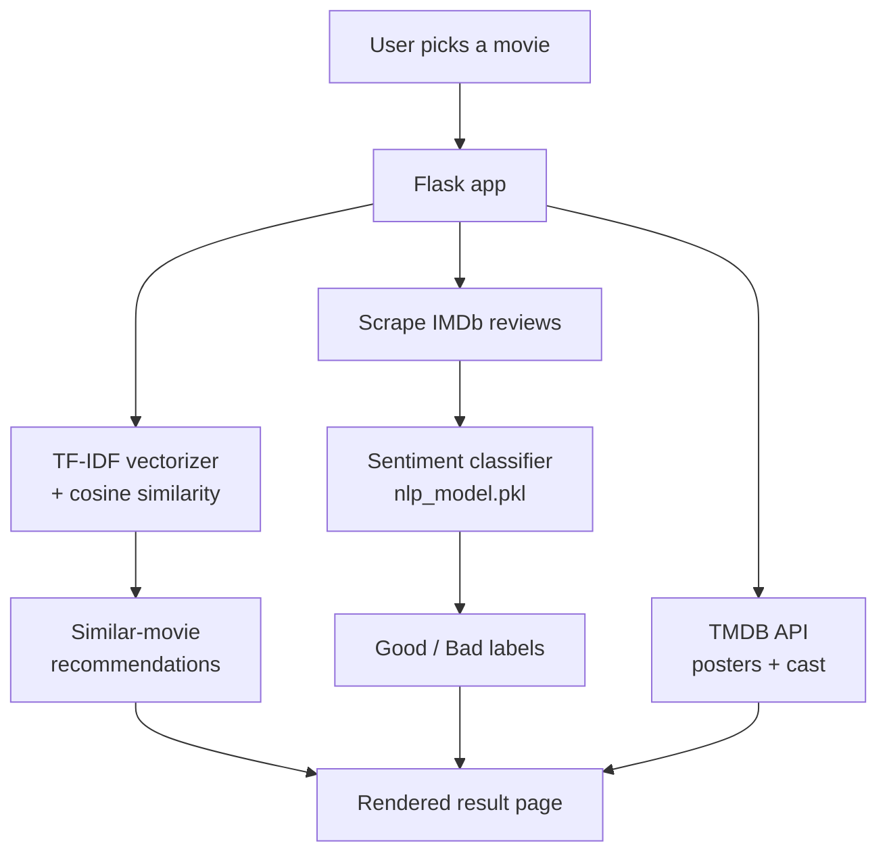

# CineSense

> AI movie recommender — content-based filtering (TF-IDF + cosine similarity) plus IMDb review sentiment analysis.

[](LICENSE)
[](https://github.com/chirag127/cinesense/stargazers)
[](https://github.com/chirag127/cinesense/commits)
[](https://python.org)
[](https://github.com/chirag127/cinesense/actions/workflows/ci.yml)

**Repo:** <https://github.com/chirag127/cinesense> · **Landing:** <https://chirag127.github.io/cinesense/>

> **Note:** Recommendations are algorithmic (content similarity + review sentiment), not professional or curated recommendations — use them as a starting point.

CineSense is a Flask web app that suggests movies similar to one you like and gauges audience reception. It combines content-based filtering (TF-IDF vectors over movie metadata, ranked by cosine similarity) with a sentiment classifier that labels scraped IMDb reviews Good/Bad — so you get both "what's like this" and "how did people feel about it."

Built on the TMDB dataset, it's a compact end-to-end ML app: preprocessing notebooks → pickled models → served predictions.

⭐ If this is useful, please [star the repo](https://github.com/chirag127/cinesense/stargazers) — it helps others find it.

> The landing at [chirag127.github.io/cinesense](https://chirag127.github.io/cinesense/) is a static info page. CineSense itself is a **Flask app that needs a Python server** to run (GitHub Pages can only host the static landing, not the live recommender).

## How it works



## Features

- Content-based movie recommendations using **TF-IDF + cosine similarity**
- **Sentiment analysis** of IMDb user reviews (Good/Bad classification)
- **TMDB dataset** with poster images and cast details
- Cached ML model loading (loaded once at startup)
- Deployable — ships a `Procfile`

## Tech stack

- **Python 3.9+**
- **[Flask](https://flask.palletsprojects.com/)** — web server + templating (Jinja2)
- **[scikit-learn](https://scikit-learn.org/)** — TF-IDF vectorizer, cosine similarity, sentiment classifier
- **TMDB dataset** + TMDB API for posters/cast
- Pickled models: `nlp_model.pkl`, `tranform.pkl`, plus `main_data.csv`

## Repo structure

```
src/cinesense/web/app.py   # Flask app + MovieRecommender class
templates/                 # Jinja2 HTML templates
static/                    # JS, CSS, images
notebooks/                 # Jupyter preprocessing notebooks
datasets/                  # Raw TMDB data
Procfile                   # deployment entry
```

## Quick start

```bash
pip install -r requirements.txt

# Place model files in the project root:
# - nlp_model.pkl (sentiment classifier)
# - tranform.pkl  (TF-IDF vectorizer)
# - main_data.csv (movie dataset)

python src/cinesense/web/app.py
```

## Configuration

Environment variables (names + purpose only — set your own values; see `.env.example`):

| Env var | Purpose |
|---|---|
| `NLP_MODEL_PATH` | Path to the sentiment-classifier pickle (`nlp_model.pkl`) |
| `VECTORIZER_PATH` | Path to the TF-IDF vectorizer pickle (`tranform.pkl`) |
| `DATA_PATH` | Path to the movie dataset CSV (`main_data.csv`) |

Posters/cast are fetched from the TMDB API at runtime.

## Part of the oriz family

CineSense is one of ~80 [oriz](https://blog.oriz.in) projects.

## Contributing

Issues and PRs welcome. Conventional commits are the changelog.

## Status

Beta — the recommender + sentiment pipeline work end-to-end; requires the pickled model files and a running Python server.

## License

MIT © 2026 Chirag Singhal · chirag@oriz.in — see [LICENSE](LICENSE).
